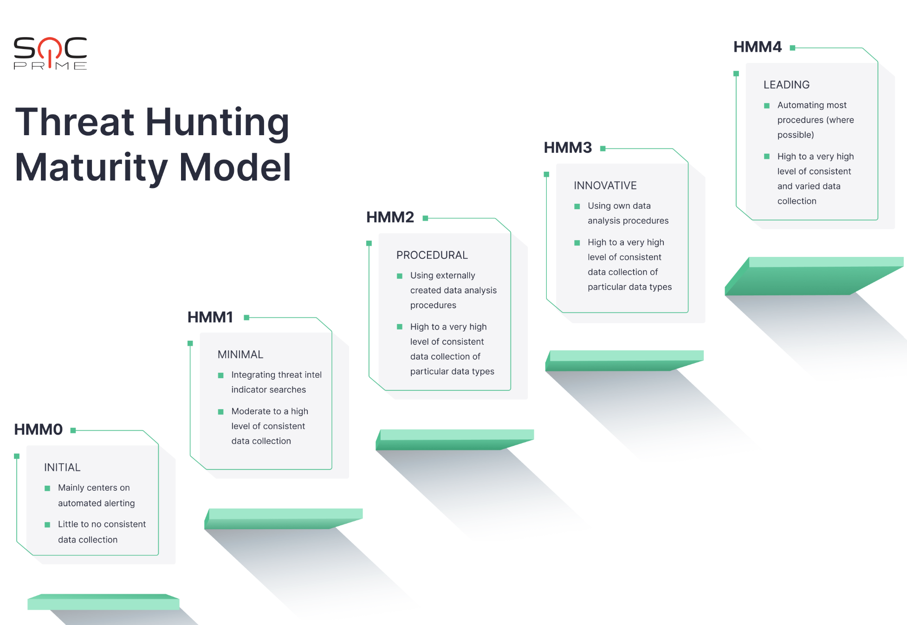

# Threat Intelligence and data-driven threat hunting

## Ứng dụng của Cyber Threat Intelligence (CTI)

Việc ứng dụng Cyber Threat Intelligence (CTI) trong bảo vệ an ninh mạng là một khía cạnh quan trọng và đầy thách thức. Dưới đây là một số cách chính mà CTI có thể được ứng dụng để cải thiện an ninh mạng:

### Nhận biết và Phản ứng với Mối Đe Dọa:

CTI cung cấp thông tin chi tiết về các chiến thuật, kỹ thuật và thủ đoạn (TTPs) mà kẻ tấn công sử dụng. Điều này giúp tổ chức nhanh chóng nhận ra các mối đe dọa và chuẩn bị các biện pháp phòng ngừa hoặc phản ứng kịp thời.

### Cập Nhật và Tùy chỉnh Hệ thống Bảo mật:

Thông tin từ CTI cho phép tổ chức cập nhật và tùy chỉnh các hệ thống bảo mật của mình để chống lại các loại tấn công cụ thể. Điều này có thể bao gồm việc cập nhật chữ ký virus, điều chỉnh các quy tắc tường lửa, hoặc triển khai các công cụ phát hiện và phản ứng nâng cao.

### Đào Tạo và Nhận Thức An Ninh:

CTI giúp tổ chức phát triển các chương trình đào tạo và nâng cao nhận thức an ninh cho nhân viên, dựa trên những mối đe dọa thực tế và cập nhật.

### Phân Tích Rủi Ro và Quyết Định Chiến Lược:

Thông tin từ CTI giúp các nhà lãnh đạo và chuyên gia an ninh đánh giá rủi ro một cách chính xác hơn và đưa ra quyết định chiến lược về đầu tư vào an ninh mạng.

### Hợp Tác và Chia Sẻ Thông Tin:

CTI thúc đẩy việc chia sẻ thông tin giữa các tổ chức, giúp cả cộng đồng doanh nghiệp và các cơ quan chính phủ có được cái nhìn toàn diện hơn về môi trường mối đe dọa.

### Ứng Dụng Trí Tuệ Nhân Tạo và Học Máy:

Sử dụng AI và học máy trong việc phân tích CTI có thể giúp tự động hóa và tối ưu hóa quá trình phát hiện và phản ứng với các mối đe dọa.

## Ứng dụng tích hợp CTI trong Threat Hunting

### Threat hunting là gì?

"Threat Hunting" hay "Săn lùng mối đe dọa" là quá trình chủ động tìm kiếm, xác định và giải quyết các mối đe dọa tiềm ẩn hoặc không rõ ràng trong mạng và hệ thống IT của một tổ chức. Khác với các hệ thống bảo mật **phản ứng tự động**, như tường lửa hay phần mềm chống virus, **threat hunting** đòi hỏi sự **can thiệp và phân tích chủ động từ các chuyên gia bảo mật**.

Các **chuyên gia bảo mật** sẽ sử dụng kỹ năng kỹ thuật, kiến thức về các mối đe dọa hiện hành, và công cụ phân tích dữ liệu để tìm kiếm dấu hiệu của các hoạt động đáng ngờ hoặc không bình thường trong hệ thống. Quá trình này bao gồm việc xem xét log, mạng, endpoint, và dữ liệu khác để phát hiện các hành vi khả nghi.

Quá trình này thường bao gồm:

#### Phân tích dữ liệu:

Xem xét các nguồn dữ liệu khác nhau để phát hiện mẫu hoạt động bất thường hoặc đáng ngờ.

#### Sử dụng Cyber Threat Intelligence:

Áp dụng thông tin từ các nguồn CTI để nhận biết các chiến thuật, kỹ thuật và thủ đoạn (TTPs) của kẻ tấn công.

#### Thí nghiệm và Giả định:

Thực hiện các giả định và thí nghiệm để kiểm tra các hệ thống chống lại các mối đe dọa tiềm ẩn.

#### Chia sẻ Thông Tin:

Chia sẻ các phát hiện với cộng đồng bảo mật rộng lớn hơn để cải thiện khả năng phòng vệ chung.

Mục tiêu của Threat Hunting không chỉ là phát hiện các mối đe dọa hiện tại, mà còn để cải thiện liên tục các chiến lược an ninh mạng và giảm thiểu rủi ro cho tổ chức.

### Tích hợp Threat Hunting và CTI

Việc tích hợp **Threat Hunting** với **Cyber Threat Intelligence (CTI)** mang lại hiệu quả cao trong việc phát hiện và phản ứng với các mối đe dọa mạng. Dưới đây là cách tích hợp hai hoạt động này:

#### Thông Tin Từ CTI Làm Cơ Sở Cho Threat Hunting:

CTI cung cấp thông tin về các TTPs, chỉ số tấn công (indicators of compromise - IoCs), và thông tin chi tiết về các chiến dịch tấn công gần đây. Các threat hunter sử dụng thông tin này để hướng dẫn việc tìm kiếm trong mạng của họ.

#### Phân Tích Dữ Liệu Mạng và Endpoint:

Sử dụng CTI, các threat hunter có thể tập trung vào việc phân tích dữ liệu mạng và endpoint để tìm kiếm hoạt động đáng ngờ liên quan đến các mối đe dọa được biết đến.

#### Ứng Dụng Kỹ Thuật Phân Tích Nâng Cao:

Các công cụ và kỹ thuật phân tích nâng cao, như học máy và AI, có thể được sử dụng để phân tích CTI và dữ liệu thu thập từ mạng, từ đó phát hiện các mẫu hành vi đáng ngờ.

#### Chia Sẻ Thông Tin và Hợp Tác:

Thông tin thu được từ quá trình threat hunting có thể được chia sẻ lại với cộng đồng CTI, tạo ra một chu trình cải tiến liên tục trong việc phát hiện và ngăn chặn các mối đe dọa.

#### Tùy Chỉnh và Cập Nhật Công Cụ Bảo Mật:

Dựa trên kết quả của threat hunting và thông tin từ CTI, các tổ chức có thể tùy chỉnh và cập nhật các công cụ bảo mật của mình để tăng cường khả năng phòng vệ.

## Thuật ngữ "the dwell time" trong threat hunting

Được sử dụng để mô tả **khoảng thời gian** mà một kẻ tấn công hoặc một mối đe dọa mạng có mặt trong hệ thống của nạn nhân trước khi được phát hiện và loại bỏ. Nói cách khác, đó là thời gian kể từ khi một mối đe dọa xâm nhập thành công vào mạng cho đến khi nó được phát hiện và xử lý.

### Ý Nghĩa của Dwell Time

#### Đánh Giá Hiệu Quả An Ninh Mạng:

Dwell Time là một chỉ số quan trọng để đánh giá hiệu quả của chiến lược an ninh mạng. Một khoảng Dwell Time dài cho thấy có thể có sự chậm trễ trong việc phát hiện và phản ứng đối với các mối đe dọa.

#### Rủi Ro và Hậu Quả:

Thời gian càng dài một kẻ tấn công có mặt trong hệ thống mà không bị phát hiện, hậu quả của cuộc tấn công càng có thể trở nên nghiêm trọng. Trong thời gian này, kẻ tấn công có thể thu thập thông tin, triển khai malware, hoặc thực hiện các hành động phá hoại khác.

#### Cải Thiện Phản Ứng:

Việc giảm Dwell Time là một mục tiêu quan trọng trong an ninh mạng. Điều này đòi hỏi việc cải thiện khả năng phát hiện mối đe dọa sớm và phản ứng nhanh chóng, thông qua việc sử dụng các công cụ phát hiện nâng cao và phương pháp săn lùng mối đe dọa chủ động.

### Dwell Time trong Threat Hunting

Trong bối cảnh Threat Hunting, việc giảm Dwell Time là một ưu tiên hàng đầu. Các chuyên gia săn lùng mối đe dọa chủ động tìm kiếm các dấu hiệu của hoạt động đáng ngờ hoặc không bình thường để phát hiện các mối đe dọa càng sớm càng tốt. Bằng cách này, họ không chỉ ngăn chặn các tấn công từ việc gây thiệt hại nghiêm trọng mà còn giúp giảm thời gian mà kẻ tấn công có thể "dwell" trong hệ thống.

## Types of Threat Hunting

Threat Hunting có thể được phân loại dựa trên cách tiếp cận và kỹ thuật sử dụng. Dưới đây là một số loại phổ biến của Threat Hunting:

### Hypothesis-Driven Hunting (Săn lùng Dựa trên Giả định):

Trong phương pháp này, các threat hunter tạo ra các giả định dựa trên thông tin về mối đe dọa hiện có, như Cyber Threat Intelligence (CTI) hoặc thông tin từ các cuộc tấn công trước đó.

Các giả định này có thể dựa trên các chiến thuật, kỹ thuật và thủ đoạn (TTPs) của kẻ tấn công, và được sử dụng để hướng dẫn việc tìm kiếm dấu vết của hoạt động đáng ngờ trong hệ thống.

### Indicator-Driven Hunting (Săn lùng Dựa trên Chỉ số):

Phương pháp này tập trung vào việc tìm kiếm các chỉ số của cuộc tấn công (Indicators of Compromise - IoCs) trong hệ thống.

IoCs có thể bao gồm địa chỉ IP đáng ngờ, hash của file malware, hoặc mẫu hành vi mạng bất thường. Mục tiêu là phát hiện nhanh chóng các dấu hiệu của một cuộc tấn công đang diễn ra hoặc đã diễn ra.

### Intelligence-Driven Hunting (Săn lùng Dựa trên Tình báo):

Đây là việc sử dụng thông tin từ các nguồn CTI để hướng dẫn việc săn lùng.

Các nguồn thông tin này có thể bao gồm báo cáo về các mối đe dọa mới, thông tin về các nhóm tấn công, hoặc các xu hướng tấn công gần đây.

### Machine Learning-Driven Hunting (Săn lùng Dựa trên Học Máy):

Sử dụng công nghệ học máy để phân tích lớn dữ liệu và phát hiện các mẫu hành vi bất thường có thể chỉ ra một mối đe dọa.

Phương pháp này thường sử dụng các thuật toán phức tạp để xác định hoạt động không bình thường mà không nhất thiết phải dựa trên các giả định hoặc chỉ số cụ thể.

### Behavior-Driven Hunting (Săn lùng Dựa trên Hành vi):

Tập trung vào việc phát hiện các hành vi đáng ngờ hoặc bất thường trong mạng hoặc trên các thiết bị.

Các hành vi này có thể bao gồm giao tiếp mạng không bình thường, thay đổi bất ngờ trong cách sử dụng tài nguyên hệ thống, hoặc việc truy cập dữ liệu nhạy cảm một cách bất thường.

### Data-Driven Hunting:

Loại này tương tự như "Indicator-Driven Hunting" hoặc "Behavior-Driven Hunting".

Trong "Data-Driven Hunting", việc săn lùng mối đe dọa dựa trên việc phân tích lớn dữ liệu từ hệ thống. Điều này bao gồm log, giao tiếp mạng, và các hành vi của người dùng và thiết bị.

Mục tiêu là phát hiện các mẫu hoặc chỉ số bất thường thông qua phân tích dữ liệu, sử dụng công cụ phân tích dữ liệu nâng cao và đôi khi là học máy.

### Entity-Driven Hunting:

Phương pháp này gần giống với "Intelligence-Driven Hunting" hoặc có thể được coi là một phần của "Hypothesis-Driven Hunting". Trong "Entity-Driven Hunting", các threat hunter tập trung vào các "entity" cụ thể trong mạng, như người dùng, thiết bị, ứng dụng, hoặc hệ thống. Mục tiêu là xác định các hành vi đáng ngờ hoặc không bình thường liên quan đến các thực thể này, dựa trên giả định hoặc thông tin từ CTI về cách thức hoạt động của kẻ tấn công.

Mỗi phương pháp săn lùng mối đe dọa này có điểm mạnh và hạn chế riêng, và nhiều tổ chức thường kết hợp nhiều phương pháp để tạo ra một chiến lược săn lùng mối đe dọa toàn diện.

## Threat hunter skill set

Threat Hunters, hay các chuyên gia săn lùng mối đe dọa, cần một loạt các kỹ năng kỹ thuật và phi kỹ thuật để thực hiện công việc của họ một cách hiệu quả. Dưới đây là một số kỹ năng quan trọng:

### Kiến Thức Về An Ninh Mạng:

Hiểu biết sâu sắc về các khái niệm an ninh mạng, bao gồm cách thức hoạt động của các loại tấn công, chiến thuật, kỹ thuật và thủ đoạn (TTPs) của kẻ tấn công.

### Kỹ Năng Phân Tích Dữ Liệu:

Khả năng phân tích log hệ thống, dữ liệu mạng, và các nguồn thông tin khác để phát hiện các hoạt động bất thường hoặc đáng ngờ.

### Hiểu Biết về Hệ Thống và Mạng:

Kiến thức vững chắc về cách thức hoạt động của hệ thống máy tính, mạng máy tính, và các giao thức truyền thông.

### Kỹ Năng Sử Dụng Công Cụ Bảo Mật:

Thành thạo các công cụ và nền tảng bảo mật như SIEM (Security Information and Event Management), IDS/IPS (Intrusion Detection/Prevention Systems), và các công cụ phân tích mạng.

### Kỹ Năng Lập Trình và Scripting:

Khả năng sử dụng ngôn ngữ lập trình như Python hoặc PowerShell để tự động hóa các quy trình và phân tích dữ liệu.

### Khả Năng Giải Quyết Vấn Đề và Tư Duy Phê Phán:

Kỹ năng giải quyết vấn đề sáng tạo và khả năng suy nghĩ phê phán để phân tích và diễn giải thông tin.

### Kỹ Năng Giao Tiếp và Báo Cáo:

Khả năng giao tiếp hiệu quả, bao gồm việc chuẩn bị báo cáo và trình bày phát hiện cho các nhóm kỹ thuật và lãnh đạo không chuyên môn.

### Theo Dõi Xu Hướng và Cập Nhật Kiến Thức:

Luôn cập nhật với các xu hướng mới và phát triển trong lĩnh vực an ninh mạng.

### Kỹ Năng Hợp Tác và Làm Việc Nhóm:

Khả năng làm việc cùng với các đội ngũ IT, an ninh mạng, và các bên liên quan khác.

### Hiểu Biết về Luật và Quy Định:

Kiến thức về các luật và quy định liên quan đến an ninh mạng và bảo vệ dữ liệu.

Sự thành công trong vai trò Threat Hunting không chỉ đòi hỏi kỹ năng kỹ thuật mạnh mẽ mà còn phụ thuộc vào khả năng sáng tạo, tư duy phê phán, và sự linh hoạt để thích nghi với môi trường đe dọa liên tục thay đổi.

## Pyramid of Pain of David Bianco

"Pyramid of Pain" của David Bianco là một khái niệm quan trọng trong lĩnh vực Tình báo Đe dọa Mạng (CTI) và Thợ săn Đe dọa (Threat Hunting). Mô hình này miêu tả các loại thông tin đe dọa mà các nhóm tấn công sử dụng và mức độ "đau đớn" mà họ phải chịu đựng khi cần phải thay đổi các chiến thuật, kỹ thuật, hoặc quy trình của họ do các biện pháp phòng thủ của chúng ta.

Pyramid of Pain giúp các tổ chức hiểu rõ ràng hơn về việc nên tập trung vào việc phát hiện và ngăn chặn những yếu tố nào trong chuỗi tấn công để gây ra sự không thoải mái và khó khăn lớn nhất cho kẻ tấn công, từ đó làm giảm khả năng thành công của các cuộc tấn công tiếp theo.

Dưới đây là mô tả từ dưới lên trên của Pyramid of Pain:

### Hash Values (Giá trị băm):

Đây là cấp độ thấp nhất của Pyramid và dễ dàng nhất để thay đổi. Giá trị băm (ví dụ: MD5, SHA1, SHA256) của các tệp độc hại có thể được thay đổi chỉ bằng cách thay đổi một byte nhỏ trong tệp đó.

### IP Addresses (Địa chỉ IP):

Địa chỉ IP có thể được thay đổi dễ dàng, nhưng việc thay đổi chúng vẫn gây ra một số "đau đớn" cho kẻ tấn công. Địa chỉ IP được sử dụng để giao tiếp giữa hệ thống bị nhiễm và máy chủ điều khiển của kẻ tấn công.

### Domain Names (Tên miền):

Tên miền có thể được thay đổi, nhưng việc đăng ký và duy trì các tên miền mới yêu cầu thời gian và nguồn lực nhiều hơn so với việc chỉ thay đổi địa chỉ IP.

### Network/Host Artifacts (Hiện vật mạng/máy chủ):

Đây bao gồm các dấu vết mà phần mềm độc hại để lại trên mạng hoặc máy chủ, chẳng hạn như cách mà nó giao tiếp hoặc các tập tin đặc biệt mà nó tạo ra. Thay đổi những hiện vật này yêu cầu nỗ lực lập trình lớn hơn.

### Tools (Công cụ):

Công cụ mà kẻ tấn công sử dụng có thể bao gồm phần mềm độc hại, các kỹ thuật tấn công mạng, và các chương trình hỗ trợ khác. Thay đổi hoặc phát triển công cụ mới là một quá trình tốn kém và phức tạp.

### TTPs (Tactics, Techniques, and Procedures - Tác phong, Kỹ thuật, và Quy trình):

Đây là cấp độ cao nhất của Pyramid of Pain. TTPs là những phương thức cốt lõi mà kẻ tấn công sử dụng để thực hiện các chiến dịch của họ. Thay đổi TTPs đòi hỏi kẻ tấn công phải thay đổi cách họ hoạt động ở mức độ cơ bản, điều này tạo ra sự "đau đớn" lớn nhất cho họ.

## threat hunting maturity model of David Bianco

Nguồn: <https://socprime.com/blog/threat-hunting-maturity-model-explained-with-examples/>

Mô hình Độ Trưởng Thành của Thợ Săn Đe Dọa (Threat Hunting Maturity Model) của David Bianco mô tả các giai đoạn phát triển khác nhau mà một tổ chức có thể trải qua khi xây dựng và triển khai chương trình thợ săn đe dọa hiệu quả. Mô hình này giúp các tổ chức xác định vị trí hiện tại của họ trong lộ trình phát triển và hướng dẫn họ về những bước tiếp theo cần thực hiện để cải thiện. Mỗi giai đoạn trong mô hình này không chỉ phản ánh mức độ kỹ năng và kinh nghiệm của tổ chức trong việc săn đe dọa mà còn chỉ ra sự phát triển của cơ sở hạ tầng, công cụ, quy trình, và văn hóa an ninh mạng. Qua đó, tổ chức có thể xác định được cách tiếp cận tốt nhất để nâng cao khả năng phát hiện và phản ứng trước các mối đe dọa.

Dưới đây là chi tiết của mỗi giai đoạn trong mô hình này:

### Level 0 - Initial (Ban đầu):

Tại giai đoạn này, tổ chức chủ yếu dựa vào các giải pháp an ninh mạng tự động và không có hoạt động thợ săn đe dọa chủ động. Các cuộc tấn công chỉ được phát hiện thông qua cảnh báo tự động từ các công cụ an ninh mạng.

### Level 1 - Minimal (Tối thiểu):

Tổ chức bắt đầu thực hiện một số hoạt động thợ săn đe dọa cơ bản. Các hoạt động này thường là phi cấu trúc và ad-hoc, với việc sử dụng các công cụ và kỹ thuật đơn giản để phát hiện các mối đe dọa.

### Level 2 - Procedural (Theo quy trình):

Tại giai đoạn này, tổ chức đã phát triển các quy trình và hướng dẫn cụ thể cho hoạt động thợ săn đe dọa. Có sự phối hợp tốt hơn giữa các nhóm và việc sử dụng công nghệ để hỗ trợ việc săn đe dọa.

### Level 3 - Innovative (Sáng tạo):

Tổ chức đã tạo ra các phương pháp và công cụ mới cho hoạt động thợ săn đe dọa. Có một sự chuyển đổi từ việc phụ thuộc vào công nghệ và công cụ sẵn có sang phát triển giải pháp nội bộ và sáng tạo.

### Level 4 - Leading (Dẫn đầu):

Đây là giai đoạn cao nhất, nơi tổ chức không chỉ thực hiện thợ săn đe dọa hiệu quả mà còn đóng góp vào cộng đồng an ninh mạng rộng lớn hơn. Tại giai đoạn này, tổ chức thường chia sẻ thông tin tình báo đe dọa, phương pháp săn đe dọa, và công cụ với cộng đồng.

## The threat hunting process by Sqrrl

Nguồn: <https://www.threathunting.net/files/framework-for-threat-hunting-whitepaper.pdf>;

Quy trình săn đe dọa do Sqrrl (một công ty trong lĩnh vực an ninh mạng được biết đến với việc phát triển phần mềm phân tích dữ liệu để phát hiện và đáp ứng đe dọa) đề xuất, cung cấp một khung làm việc cụ thể và hệ thống cho hoạt động săn đe dọa.

Quy trình săn đe dọa theo Sqrrl nhấn mạnh sự kết hợp giữa phân tích chủ động và thông tin tình báo đe dọa để phát hiện và phản ứng nhanh chóng trước các mối đe dọa. Điều này không chỉ giúp phát hiện các mối đe dọa đã biết mà còn giúp phát hiện các hoạt động độc hại mới và không xác định trước được.

Quy trình này được chia thành các bước sau:

### Hypothesis Generation (Tạo Giả Thuyết):

Quá trình bắt đầu bằng việc tạo ra các giả thuyết về các mối đe dọa tiềm tàng hoặc hoạt động độc hại trong mạng. Giả thuyết này thường dựa trên thông tin tình báo đe dọa, kiến thức về hạ tầng IT, nhận thức về các điểm yếu bảo mật, hoặc các dấu hiệu bất thường đã quan sát được.

### Data Collection (Thu Thập Dữ Liệu):

Dựa trên giả thuyết, thu thập dữ liệu từ các nguồn khác nhau trong môi trường mạng. Điều này có thể bao gồm logs, dữ liệu từ các cảm biến mạng, thông tin từ các điểm cuối, và dữ liệu từ các hệ thống quản lý an ninh.

### Data Processing (Xử Lý Dữ Liệu):

Tiếp theo, dữ liệu được xử lý và chuẩn hóa để phân tích. Điều này có thể bao gồm việc lọc, phân loại, và gắn thẻ dữ liệu để dễ dàng phân tích hơn.

### Data Enrichment (Tăng Cường Dữ Liệu):

Dữ liệu sau đó được tăng cường với các thông tin bổ sung từ các nguồn ngoài như cơ sở dữ liệu về địa chỉ IP độc hại, tên miền độc hại, hoặc các thông tin tình báo đe dọa khác.

### Analysis (Phân Tích):

Sử dụng các kỹ thuật phân tích để kiểm tra dữ liệu, tìm kiếm các mẫu, hành vi bất thường, hoặc các dấu hiệu của hoạt động độc hại dựa trên giả thuyết ban đầu.

### Inform and Enrich Hypothesis (Thông Tin và Tăng Cường Giả Thuyết):

Dựa trên kết quả phân tích, giả thuyết có thể được điều chỉnh, cập nhật hoặc tăng cường để phản ánh thông tin mới tìm được.

### Operationalize Findings (Vận hành Hóa Kết Quả):

Cuối cùng, kết quả phân tích và các thông tin liên quan được sử dụng để cải thiện các chính sách bảo mật, cập nhật các quy tắc phòng chống xâm nhập (IPS/IDS), hoặc thực hiện các biện pháp khắc phục cần thiết.

## SANS Threat Hunting Model

Nguồn: <https://sansorg.egnyte.com/dl/hfu5PAbiPz>;

### Mục đích:

Thực hiện săn lùng mối đe dọa luôn cần phải hướng tới mục tiêu của tổ chức, ví dụ, việc săn lùng có thể được điều kiện bởi các mục tiêu kinh doanh dài hạn. Ở giai đoạn này, chúng ta cần nêu rõ mục đích của việc săn lùng, bao gồm dữ liệu cần thiết để thực hiện và kết quả mong muốn.

### Phạm vi:

Giai đoạn này bao gồm việc xác định giả thuyết, và xác định mạng, hệ thống, mạng con hoặc máy chủ mà chúng ta muốn trích xuất dữ liệu từ đó. Phạm vi phải được thiết lập rõ ràng trước đó để giảm thiểu "nhiễu" có thể ảnh hưởng đến thành công của việc săn lùng. Phạm vi không nên quá cụ thể vì có thể bỏ qua sự hiện diện của kẻ tấn công trong môi trường. Giả thuyết sẽ ngăn chúng ta đi chệch khỏi mục tiêu, giúp người săn lùng duy trì tập trung trong khi di chuyển từ dữ liệu này sang dữ liệu khác.

### Trang bị:

Trong giai đoạn này, trọng tâm là "làm thế nào". Dữ liệu sẽ được thu thập như thế nào? Liệu việc thu thập có đủ chi tiết? Chúng ta sẽ phân tích dữ liệu như thế nào? Làm thế nào để tránh thiên kiến? Vào cuối giai đoạn này, người săn lùng mối đe dọa phải có câu trả lời chi tiết cho từng câu hỏi này. Việc triển khai khung quản lý thu thập (CMF) có thể giúp chúng ta theo dõi dữ liệu nào được thu thập và nguồn gốc của dữ liệu đó.

### Kiểm tra kế hoạch:

Như tên gọi của nó, người phụ trách nhóm hoặc việc săn lùng sẽ xem xét tất cả các kế hoạch đã được thực hiện cho đến nay để đảm bảo việc săn lùng sẽ đáp ứng các mục tiêu của tổ chức và nhóm có tất cả các nguồn lực cần thiết (nhân sự, dữ liệu, công cụ và thời gian) để thực hiện việc săn lùng thành công.

### Thực hiện:

Giai đoạn thực hiện đề cập đến việc săn lùng chính thức sau khi kế hoạch đã được phê duyệt.

### Phản hồi:

Giai đoạn này liên quan đến tất cả các giai đoạn trước đó. Phân tích kết quả sẽ giúp nhóm thực hiện các cuộc săn lùng trong tương lai với hiệu quả cao hơn. Mục đích của giai đoạn phản hồi là cải thiện tất cả các giai đoạn trước đó. Nó nhằm mục đích giúp chúng ta xác định không chỉ mục tiêu đã đạt được hay chưa, mà còn cả bất kỳ thiên kiến nào mà nhóm có thể gặp phải, những lỗ hổng về khả năng nhìn thấy và thu thập dữ liệu cần được khắc phục, việc phân bổ tài nguyên có chính xác hay không, v.v.

## The data-driven methodology

Nguồn: <https://www.youtube.com/watch?v=DuUF-zXUzPs>;

Sáu giai đoạn được định nghĩa bởi anh em nhà Rodriguez như sau:

### Xác định mục tiêu nghiên cứu:

Để xác định mục tiêu nghiên cứu khi thực hiện săn lùng dựa trên dữ liệu, điều quan trọng là phải hiểu rõ dữ liệu và ánh xạ dữ liệu với hoạt động của kẻ thù. Roberto Rodriguez đưa ra một loạt câu hỏi xuất sắc mà chúng ta nên có thể trả lời để xác định mục tiêu nghiên cứu của mình:

-   Chúng ta sẽ săn lùng cái gì?
-   Tôi có hiểu dữ liệu của mình không? Tôi có một wiki dữ liệu không?
-   Tôi có lưu trữ dữ liệu ở đâu đó trong môi trường của mình không?
-   Chúng ta đã ánh xạ nhật ký với hành động của kẻ thù chưa?
-   Tôi cần phải cụ thể đến mức nào?
-   Tôi có thể bao phủ bao nhiêu kỹ thuật/phụ kỹ thuật cho mỗi giả thuyết?
-   Tôi có đang tập trung vào những người kích hoạt kỹ thuật hay vào hành vi chính không?

### Mô hình hóa dữ liệu:

Giai đoạn này của quy trình xoay quanh việc hiểu dữ liệu đến từ đâu, gửi nhật ký đến một hồ dữ liệu để tham khảo, và cấu trúc dữ liệu bằng cách tạo từ điển dữ liệu, trong đó mỗi nguồn dữ liệu "cần được ánh xạ với một sự kiện". Quy trình này rất hữu ích nếu bạn muốn thực sự hiểu dữ liệu bạn đang thu thập.

**OSSEM**: Để hỗ trợ công việc nặng nhọc của việc tạo từ điển dữ liệu, anh em nhà Rodriguez đã tạo ra Dự án Metadata Sự Kiện Bảo Mật Mã Nguồn Mở (OSSEM) để tài liệu hóa và chuẩn hóa nhật ký sự kiện bảo mật. Dự án là mã nguồn mở và có thể truy cập thông qua kho lưu trữ GitHub của dự án: <https://github.com/OTRF/OSSEM>

### Mô phỏng kẻ thù:

Mô phỏng kẻ thù là một cách để các đội đỏ sao chép hành vi của kẻ thù trong môi trường của tổ chức họ. Để làm được điều này, cần phải ánh xạ hành vi của kẻ thù và chuỗi các kỹ thuật mà họ sử dụng lại với nhau để tạo ra một kế hoạch hành động. Khung MITRE ATT&CK™ cung cấp một ví dụ về cách tạo một kế hoạch mô phỏng dựa trên APT3: [Adversary Emulation Plans \| MITRE ATT&CK®](https://attack.mitre.org/resources/adversary-emulation-plans/)

**Mordor**: Đối với giai đoạn này của cuộc săn, anh em nhà Rodriguez đã tạo ra dự án Mordor, cung cấp "sự kiện bảo mật được ghi trước do các kỹ thuật mô phỏng đối thủ tạo ra" dưới dạng JSON: <https://github.com/OTRF/Security-Datasets>

### Xác định mô hình phát hiện:

Hỗ trợ cuộc săn dựa trên mô hình dữ liệu được tạo ra ở bước 2, chúng ta thiết lập cách thức mà chúng ta sẽ thực hiện cuộc săn. Sau khi xác định cách thức ở bước trước, chúng ta xác nhận phát hiện trong môi trường thử nghiệm. Nếu chúng ta không nhận được kết quả nào, chúng ta nên quay lại và xem xét lại công việc chúng ta đã làm ở các bước trước.

### Xác nhận mô hình phát hiện:

Một khi chúng ta hài lòng với kết quả thu được trong môi trường thử nghiệm và đã đánh giá chất lượng dữ liệu (tính đầy đủ, nhất quán, và kịp thời), chúng ta có thể thử nghiệm phát hiện của mình trong sản xuất. Có ba kết quả có thể xảy ra: **không có kết quả**, nơi hành vi của kẻ thù không tồn tại trong môi trường sản xuất; **ít nhất một kết quả**, nơi chúng ta cần xem xét kỹ lưỡng kết quả để xác nhận sự vi phạm; và nơi kết quả của cuộc săn tạo ra **một lượng lớn kết quả**. Kịch bản cuối cùng thường có nghĩa là cần phải điều chỉnh thêm quy trình của chúng ta.

**The Helk**: Đây là một nền tảng săn lùng được thiết kế bởi Roberto Rodriguez, dựa trên Elasticsearch, Logstash và Kibana. Nó cũng cung cấp khả năng phân tích nâng cao thông qua Jupyter Notebooks và Apache Spark: <https://github.com/Cyb3rWard0g/HELK>

### Ghi chép và truyền đạt phát hiện:

Nếu bạn thực hiện đúng các bước trước, có lẽ bạn đã hoàn thành được một nửa công việc. Việc ghi chép quy trình săn lùng nên được thực hiện đồng thời với việc thực hiện săn lùng.

**Sổ Tay Săn Lùng Mối Đe Dọa**: Dự án mã nguồn mở này được duy trì bởi anh em nhà Rodriguez và nhằm mục đích hỗ trợ dự án tài liệu hóa và chia sẻ các khái niệm săn lùng mối đe dọa, phát triển các kỹ thuật nhất định, và xây dựng giả thuyết: <https://github.com/OTRF/ThreatHunter-Playbook> ; <https://threathunterplaybook.com/tutorials/jupyter/introduction.html>;

## Xây dựng giả thuyết

Nguồn: [Generating Hypotheses for Successful Threat Hunting \| SANS Institute](https://www.sans.org/white-papers/37172/)

Trong suốt chương này, chúng ta đã nhấn mạnh rằng một trong những đặc điểm chính của săn lùng mối đe dọa là hoạt động này do **con người chủ đạo** và **không thể tự động hóa hoàn toàn**. Cốt lõi của quá trình này là **tạo ra giả thuyết** cho cuộc săn lùng, đề cập đến các mối đe dọa đối với môi trường của tổ chức phù hợp với **linh cảm của người săn lùng** và **cách thức phát hiện chúng**. Giả thuyết một phần dựa trên quan sát, nơi chúng ta nhận thấy **những sai lệch** so với đường cơ sở, và một phần dựa trên thông tin, có thể đến **từ kinh nghiệm** hoặc từ các nguồn khác.

Việc xây dựng giả thuyết là vô cùng quan trọng để thực hiện những cuộc săn lùng hiệu quả. Giả thuyết được xác định kém sẽ dẫn đến kết quả hoặc kết luận sai. Điều này rất có thể sẽ ảnh hưởng tiêu cực đến tổ chức, vì những lỗ hổng về phòng thủ và khả năng hiển thị sẽ bị bỏ sót và tạo ra môi trường thuận lợi cho kẻ tấn công. Thiếu khả năng hiển thị đầy đủ là kẻ thù tồi tệ nhất của một tổ chức, vì nó tạo ra cảm giác an toàn giả tạo, khiến cho người ta lầm tưởng rằng các vi phạm không xảy ra.

Giả thuyết được xây dựng tốt phải **ngắn gọn** và **cụ thể**. Nó phải có khả năng kiểm tra mà không giả định nguồn thời gian và tài nguyên vô hạn. Một giả thuyết mà người săn lùng không thể kiểm tra là không hữu ích, vì vậy các **công cụ họ có sẵn** và **dữ liệu cần thiết** cũng phải được cân nhắc. Giả thuyết không được quá rộng cũng không quá cụ thể, nhưng phải chỉ rõ dữ liệu sẽ được thu thập từ đâu và tìm kiếm những gì.

Có một số loại giả thuyết khác nhau, mỗi loại phản ánh một phương pháp tiếp cận và tư duy khác nhau trong việc tìm kiếm và phân tích các mối đe dọa. Mỗi loại giả thuyết có cách tiếp cận riêng và đều quan trọng trong quá trình cyber threat hunting. Việc kết hợp nhiều loại giả thuyết có thể giúp tăng cường hiệu quả trong việc phát hiện và phản ứng đối với các mối đe dọa mạng.

Dưới đây là một số loại giả thuyết phổ biến:

### Indicator-Based Hypotheses (Giả thuyết dựa trên chỉ báo):

Loại giả thuyết này dựa trên các dấu hiệu hoặc chỉ báo (indicators) của sự xâm nhập hoặc hoạt động đáng ngờ. Các chỉ báo này có thể bao gồm địa chỉ IP độc hại, tên miền, hoặc các dấu hiệu của phần mềm độc hại (malware).

### Tactic, Technique, and Procedure (TTP) Based Hypotheses (Giả thuyết dựa trên chiến thuật, kỹ thuật và thủ tục):

Loại giả thuyết này tập trung vào việc phát hiện các chiến thuật, kỹ thuật, và thủ tục được sử dụng bởi kẻ tấn công. Nó dựa trên hiểu biết về các phương pháp mà các nhóm tấn công cụ thể hay sử dụng.

### Anomaly-Based Hypotheses (Giả thuyết dựa trên bất thường):

Trong loại giả thuyết này, người săn lùng sẽ tìm kiếm các hoạt động bất thường hoặc không bình thường trong hệ thống hoặc mạng. Điều này có thể bao gồm việc phát hiện lưu lượng mạng bất thường, hoạt động tài khoản không đúng cách, hoặc những thay đổi khác nhau trong cấu hình hệ thống.

### Intelligence-Driven Hypotheses (Giả thuyết dựa trên tình báo):

Loại này sử dụng thông tin từ các nguồn tình báo mạng để xây dựng giả thuyết. Điều này có thể bao gồm thông tin về các mối đe dọa mới, các nhóm tấn công, hoặc các thông tin chiến lược khác mà có thể giúp nhận diện và chống lại các mối đe dọa.

### Scenario-Based Hypotheses (Giả thuyết dựa trên kịch bản):

Loại giả thuyết này tạo ra các kịch bản tấn công có thể xảy ra dựa trên thông tin hiện có. Nó thường sử dụng trong việc lập kế hoạch và chuẩn bị cho các cuộc tấn công tiềm tàng.

### "Domain Expertise-Based Hypothesis" (Giả thuyết dựa trên kinh nghiệm, chuyên môn) :

Trong Cyber Threat Hunting, theo các nguồn như SANS, đề cập đến loại giả thuyết sử dụng kiến thức và kỹ năng chuyên môn sâu của người săn lùng mối đe dọa trong một lĩnh vực cụ thể. Phương pháp này tận dụng sự hiểu biết sâu rộng và những hiểu biết chuyên sâu mà chuyên gia có trong các lĩnh vực nhất định như kiến trúc mạng, quản trị hệ thống, phát triển ứng dụng, hoặc các lĩnh vực an ninh mạng cụ thể.

Trong loại giả thuyết này, người săn lùng sử dụng kiến thức sâu về cách thức hoạt động của hệ thống và mạng, cùng với sự hiểu biết về những lỗ hổng và rủi ro thường gặp liên quan đến lĩnh vực chuyên môn của họ. Ví dụ, một chuyên gia mạng có thể xây dựng giả thuyết dựa trên những mô hình giao thông mạng bất thường, hoặc một nhà phát triển ứng dụng có thể tập trung vào những điểm yếu về an ninh trong mã ứng dụng.

Giả thuyết dựa trên chuyên môn lĩnh vực rất có giá trị vì nó cho phép người săn lùng nhận diện những bất thường tinh tế hoặc mô hình có thể bị bỏ qua bởi hệ thống tự động hoặc những người kém kinh nghiệm hơn. Phương pháp này thường được sử dụng kết hợp với các loại giả thuyết khác, như giả thuyết dựa trên chỉ báo hoặc TTP, để cung cấp một chiến lược săn lùng mối đe dọa toàn diện hơn.

Nguồn:

<https://www.splunk.com/en_us/blog/security/peak-hypothesis-driven-threat-hunting.html>;

<https://www.cyborgsecurity.com/blog/threat-hunting-hypothesis-examples-five-hunts-to-start-out/>;

[https://www.knowledgehut.com/blog/security/cyber-threat-hunting\#frequently-asked-questions](https://www.knowledgehut.com/blog/security/cyber-threat-hunting#frequently-asked-questions);
