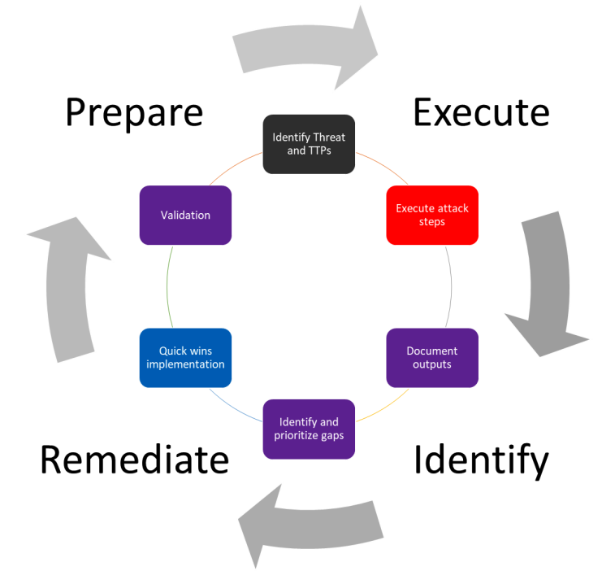

# Nâng Cao Khả Năng Chống Chịu Các Cuộc Tấn Công Trên Không Gian Mạng Thông Qua Chiến Lược Về Độ Trưởng Thành ATTT, Mô Hình Purple Teaming Và Trung Tâm Tổng Hợp An Ninh Mạng

Trong bối cảnh các mối đe dọa kỹ thuật số liên tục biến đổi, ATTT đã trở thành yếu tố then chốt ảnh hưởng đến hiệu quả của doanh nghiệp trên mọi lĩnh vực. Khi đối mặt với sự gia tăng nhanh chóng của các nguy cơ trên nền tảng mạng, các doanh nghiệp không ngừng đầu tư nguồn lực tài chính để củng cố hệ thống ATTT. Tuy nhiên, việc đo lường hiệu quả và thành quả cụ thể của những khoản đầu tư này là một thách thức. Do đó, **việc đánh giá** và **cải thiện thường xuyên** mức **độ trưởng thành ATTT** của tổ chức đã trở thành yếu tố quan trọng nhất trong việc định hướng một cách tối ưu để nâng cao tư thế ATTT của tổ chức.

Các tổ chức cần lùi lại một bước và đánh giá bối cảnh rộng hơn trong bối cảnh các giải pháp bảo mật mới nổi giải quyết các trường hợp sử dụng cụ thể. Về bản chất, điều này bao gồm việc xác định và khắc phục những thiếu sót và thách thức cơ bản trong hoạt động bảo mật của họ.

Hành trình hướng tới độ trưởng thành ATTT đòi hỏi một quá trình đánh giá đa diện về hoạt động bảo mật của tổ chức. Quá trình này bắt đầu với việc xây dựng một chiến lược ATTT toàn diện và kế hoạch quản lý sự cố. Phân tích này đóng vai trò là nền tảng để giải quyết các khủng hoảng một cách hiệu quả và giảm thiểu thiệt hại tiềm tàng cho tài sản có giá trị, hoạt động vận hành và thương hiệu của doanh nghiệp.

Một khía cạnh quan trọng không kém của độ trưởng thành ATTT là đánh giá khả năng của tổ chức trong việc thực hiện các giai đoạn khác nhau thông qua vòng đời **khả năng ứng phó với sự cố.** Đánh giá toàn diện này bao gồm cả **phát hiện, ngăn chặn, ứng phó** và các giai đoạn tiếp theo.

Cải thiện hoạt động bảo mật bao gồm việc giải quyết một số thách thức cốt lõi đang ảnh hưởng đến các đội vận hành hiện nay. Trung tâm Điều hành An ninh (SOC) tập trung vào *giám sát*, **ứng phó** và **phân tích sự cố**. SOC ngày nay đang bị quá tải bởi số lượng **cảnh báo** (alerts) khổng lồ. Càng triển khai nhiều công cụ, càng nhiều cảnh báo được tạo ra. Số lượng cảnh báo khổng lồ này ảnh hưởng đến khả năng đánh giá hiệu quả của một nhóm để xác định cảnh báo nào có thể đại diện cho mối đe dọa thực sự. Để cải thiện mức độ trưởng thành ATTT, SOC cần trở nên chủ động hơn chứ không chỉ đơn thuần ứng phó.

Một hướng đi đầy hứa hẹn để nâng cao các biện pháp bảo mật là tích hợp các trung tâm An ninh mạng (hay là hợp nhất – Cyber Fusion Centers). Trung tâm này đóng vai trò như sự tiến hóa của SOC truyền thống, hợp nhất các yếu tố của trung tâm điều hành ATTT, ATTT vật lý, quản lý chống gian lận, vận hành CNTT, phân tích dữ liệu, tự động hóa và nhiều dịch vụ khác để cho phép Fusion SOC trở nên chủ động hơn.

Và khái niệm **Purple Teaming** đưa thêm một lớp sức mạnh nữa cho phương pháp tiếp cận toàn diện này. Bằng cách tích hợp phương pháp luận **Purple Teaming** vào môi trường trung tâm An ninh mạng hợp nhất **(Cyber Fusion Center-CFC),** các tổ chức có thể liên tục đánh giá và cải thiện khả năng bảo mật của mình. Sự hợp tác giữa các nhóm **Red và Blue** bên trong CFC phản ánh các kịch bản tấn công thực tế, cung cấp những hiểu biết sâu sắc về mức độ sẵn sàng về phòng thủ của tổ chức trước các mối đe dọa. Sự kết hợp sức mạnh của **Purple Teaming** vào một **CFC** tăng cường khả năng của tổ chức trong việc chủ động giải quyết các mối đe dọa mới nổi, hợp lý hóa hoạt động và củng cố khả năng chống chịu trong bối cảnh mối đe dọa đang phát triển một cách tinh vi và phức tạp, đảm bảo một cách tiếp cận chủ động và toàn diện về ATTT khi các doanh nghiệp vật lộn với các mối đe dọa ATTT không ngừng thay đổi.

Sự ra đời của CFC như một SOC thế hệ tiếp theo mang đến giải pháp đầy hứa hẹn cho thách thức về độ trưởng thành ATTT mà các tổ chức phải đối mặt. CFC đóng vai trò như một chất xúc tác, thúc đẩy đổi mới trong hoạt động ATTT bằng cách tối ưu hóa con người, quy trình và công nghệ. Việc áp dụng một CFC ngày càng được ưa chuộng như một chiến lược để tái cấu trúc hoạt động ATTT một cách hiệu quả, từ đó nâng cao sự trưởng thành về mặt ATTT trong tổ chức.

Một CFC tổng hợp các chức năng ATTT thành một khung thống nhất, bao gồm săn lùng (*threat hunt*) và tình báo mối đe dọa (*threat intelligence*), ứng phó sự cố (*incident response*), quản lý trường hợp sử dụng (*use case management*) và quy trình vận hành chuẩn (*standard operating procedures*). Việc tích hợp này loại bỏ sự hoạt động riêng rẽ của các đội ATTT, thúc đẩy chia sẻ thông tin và hợp tác tốt hơn.

CFCs mang lại lợi thế cạnh tranh trong việc đánh giá tình báo mối đe dọa (*threat intelligence*) bằng cách mở rộng việc thu thập, phân tích và phân phối thông tin đối với các đối tượng trên từng khu vực địa lý và tác nhân đe dọa (*threat actor*) đa dạng. Bằng cách tổng hợp tình báo các mối đe dọa từ các nguồn nội bộ, bên ngoài và sử dụng công nghệ như học máy, một CFC tối ưu hóa quy trình phát hiện và ứng phó với các mối đe dọa, cho phép các đội tập trung vào những mối đe dọa quan trọng. Việc phân phối tin tình báo về các mối đe dọa cho các bên liên quan có thể cải thiện không chỉ khả năng ứng phó hiệu quả hơn với sự cố mà còn cải thiện một cách liên tục tư thế ATTT của tổ chức.

Các tổ chức cần củng cố khả năng ứng phó với rủi ro tiềm tàng một cách nhanh chóng và thông minh. Đây là lý do thúc đẩy việc kết hợp các giải pháp *SIEM (quản lý sự cố và sự kiện ATTT),* *SOAR (tổ chức ATTT và tự động hóa*) và *XDR (phát hiện và ứng phó mở rộng)* trong một CFC. Điều này giúp tinh gọn hoạt động ATTT bằng cách sử dụng các công cụ và công nghệ ATTT đa dạng với khả năng tự động hóa. Bằng cách tự động hóa các nhiệm vụ lặp đi lặp lại và áp dụng các kỹ thuật phân tích, các nhà phân tích ATTT có thể tập trung vào điều tra những mối đe dọa quan trọng nhất.

Đối với các CISO, CFC mang lại khả năng tăng cường ATTT, cải thiện và tiếp cận chủ động hơn trong việc ứng phó với sự cố và giảm thiểu rủi ro. Nó cung cấp sự giám sát toàn diện về bối cảnh các mối đe dọa, chỉ số hiệu suất (KPI) ATTT và quy trình quản lý sự cố. Điều này giúp quản lý hoạt động ATTT hiệu quả hơn và đánh giá một cách liên tục tiến trình ATTT sao cho phù hợp với chiến lược ATTT tổng thể của tổ chức.

Để đảm bảo việc triển khai CFC, có một số yếu tố then chốt cần xem xét. Mặc dù nhiều tổ chức đã thiết lập nhiều SOC, nhưng việc tích hợp và hợp tác giữa các thành phần này thường không đạt được sự kết hợp tối ưu. Một CFC mở rộng khả năng của SOC thông qua công nghệ và quy trình, tăng cường khả năng của các đội ATTT để xác định và ứng phó với các mối đe dọa tiềm tàng. Nó cũng giúp tinh gọn việc quản trị và tăng cường khả năng theo dõi các mối đe dọa, dẫn đến những cải tiến liên tục trong sự trưởng thành về mặt ATTT và đạt được mục tiêu ATTT của tổ chức.

Việc tích hợp CFC cho phép các tổ chức nâng cao **độ trưởng thành ATTT** và xây dựng khả năng chống chịu bền vững trước các tấn công mạng. Bằng cách tập trung vào sự trưởng thành của **quy trình, hiệu quả hoạt động và quản lý rủi ro toàn diện**, một tổ chức có thể gặt hái những lợi ích từ việc **phát hiện mối đe dọa** (*threat detection*), **ứng phó nhanh chóng với sự cố** (*IR*) và **bảo vệ hiệu quả đầu tư** (*ROI*) của mình.

Nguồn tham khảo <https://www.persistent.com/blogs/enhancing-cyber-resilience-through-cybersecurity-maturity-purple-teaming-and-cyber-fusion-centers/>

# Tối Ưu Hóa Thực Hành Purple Teaming thông qua Giải Pháp Breach Attack Simulation (BAS): Một Cách Tiếp Cận Đổi Mới để Tăng Cường An Ninh Mạng

## Purple Teaming

### Khái Niệm Nền Tảng Của Việc Thực Hành Purple Teaming: Threat-Informed Defense (Tư Duy Phòng Thủ Dựa Trên Mối Đe Dọa)

Là một phương pháp tiếp cận ATTT tập trung vào việc hiểu rõ các mối đe dọa và sử dụng thông tin đó để cải thiện khả năng bảo vệ của tổ chức. Phương pháp này khác với cách tiếp cận truyền thống, vốn tập trung vào việc triển khai các biện pháp bảo mật chung mà không xem xét cụ thể các mối đe dọa đang tồn tại.

**Tư duy phòng thủ dựa trên mối đe dọa dựa trên ba nguyên tắc chính**:

-   **Hiểu rõ mối đe dọa**: Bước đầu tiên của **tư duy phòng thủ dựa trên mối đe dọa** là hiểu rõ các mối đe dọa mà tổ chức đang phải đối mặt. Điều này bao gồm việc nghiên cứu các mối đe dọa hiện tại và mới nổi, cũng như phân tích các chiến thuật, kỹ thuật và quy trình (TTP) của các tác nhân gây hại **(threat actor)**.
-   **Sử dụng thông tin mối đe dọa**: Khi tổ chức đã hiểu rõ các mối đe dọa, họ có thể sử dụng thông tin đó để cải thiện khả năng bảo vệ của mình. Điều này có thể bao gồm việc triển khai các biện pháp bảo mật cụ thể để bảo vệ chống lại các mối đe dọa đã biết, cũng như đào tạo nhân viên về cách nhận biết và ứng phó với các cuộc tấn công.
-   **Thường xuyên theo dõi và cập nhật**: Các mối đe dọa đang liên tục thay đổi, vì vậy điều quan trọng là phải thường xuyên theo dõi và cập nhật thông tin mối đe dọa của tổ chức. Điều này sẽ giúp đảm bảo rằng tổ chức luôn được bảo vệ khỏi các mối đe dọa mới nhất.

    **Tư duy phòng thủ dựa trên mối đe dọa mang lại một số lợi ích quan trọng cho các tổ chức, bao gồm**:

-   **Cải thiện khả năng phát hiện và ứng phó**: Bằng cách hiểu rõ các mối đe dọa, các tổ chức có thể phát hiện và ứng phó với các cuộc tấn công nhanh chóng và hiệu quả hơn.
-   **Giảm thiểu rủi ro**: Tư duy phòng thủ dựa trên mối đe dọa giúp các tổ chức giảm thiểu rủi ro bị tấn công và tổn thất tài chính.
-   **Tăng cường khả năng phục hồi**: Tư duy phòng thủ dựa trên mối đe dọa giúp các tổ chức phục hồi nhanh chóng hơn sau các cuộc tấn công.

    Tư duy phòng thủ dựa trên mối đe dọa là một phương pháp tiếp cận ATTT tiên tiến đang ngày càng trở nên phổ biến. Phương pháp này cung cấp một cách tiếp cận toàn diện và hiệu quả hơn để bảo vệ các tổ chức khỏi các mối đe dọa mạng.

    Dưới đây là một số ví dụ cụ thể về cách các tổ chức có thể áp dụng tư duy phòng thủ dựa trên mối đe dọa:

-   Một tổ chức có thể sử dụng thông tin mối đe dọa để triển khai các biện pháp bảo mật cụ thể để bảo vệ chống lại các cuộc tấn công mạng phổ biến, chẳng hạn như tấn công lừa đảo email hoặc tấn công phần mềm độc hại.
-   Một tổ chức có thể sử dụng thông tin mối đe dọa để đào tạo nhân viên về cách nhận biết và ứng phó với các cuộc tấn công mạng. Ví dụ, nhân viên có thể được đào tạo về cách xác định các email lừa đảo hoặc cách cài đặt phần mềm an toàn.
-   Một tổ chức có thể sử dụng thông tin mối đe dọa để giám sát các hoạt động mạng của mình để tìm kiếm các dấu hiệu của các cuộc tấn công. Ví dụ, tổ chức có thể sử dụng hệ thống phát hiện xâm nhập (IDS) để phát hiện các truy cập trái phép vào mạng của mình.

    Tư duy phòng thủ dựa trên mối đe dọa là một phương pháp tiếp cận ATTT linh hoạt có thể được áp dụng theo nhiều cách khác nhau. Bằng cách hiểu rõ các mối đe dọa và sử dụng thông tin đó một cách hiệu quả, các tổ chức có thể cải thiện đáng kể khả năng bảo vệ của mình.

## Breach Attack Simulation (Mô phỏng Tấn công Vi phạm Dữ liệu - BAS)

Là một hình thức kiểm tra ATTT tiên tiến, là một phần của kho vũ khí của đội Purple Teaming (Đội Tím). Trước đây, hệ thống phòng thủ của đội Blue Team (Đội Xanh) được kiểm tra thông qua các bài tập của đội Red Team (Đội Đỏ), nhưng vấn đề chính của cách tiếp cận này là nó không tự động và chỉ được coi là một phần vì phụ thuộc vào sở thích và kỹ năng của người vận hành đội Red Team, điều này có thể thay đổi đáng kể từ người này sang người khác.

BAS là một khái niệm cho phép kỹ sư ATTT có thể mô phỏng lại các cuộc tấn công vào và từ mọi khu vực (bên ngoài, bên trong, điểm cuối) một cách thủ công hoặc tự động, dựa vào các giải pháp cụ thể. Họ sẽ phân loại và chuẩn hóa các cuộc tấn công được tạo ra, ánh xạ chúng vào các khuôn khổ hiện có (như **MITRE ATT&CK**), kiểm tra xem chúng có bị chặn hoặc phát hiện không, và cuối cùng là cung cấp một báo cáo.

Lợi ích chính của phương pháp này là các cập nhật liên tục từ nhà cung cấp và cộng đồng, cho phép các tổ chức kiểm tra các cuộc tấn công và TTPs (Tactics, Techniques, and Procedures - Chiến thuật, Kỹ thuật và Quy trình) mới. Do đó, nó giúp chúng ta cải thiện hệ thống phòng thủ một cách liên tục và tự động. Công cụ này cũng cho phép theo dõi liên tục năng lực phát hiện và ngăn chặn các mối đe đọa để đảm bảo các biện pháp ATTT vẫn hoạt động hiệu quả. Nó cũng ngăn lỗi của con người trong các bài kiểm tra vì được thực hiện một cách tự động.

## Quy Trình của Purple Teaming

Qui trình Purple Teaming kết hợp các hoạt động của Red Team (Đội Đỏ) và Blue Team (Đội Xanh) trong một bài tập chung, với sự hỗ trợ từ đội CTI (Cyber Threat Intelligence - Tình báo Mối đe dọa Mạng) và **một điều phối viên bài tập (project manager)**. Cách tiếp cận kết hợp này giúp cải thiện ATTT toàn diện cho tổ chức nhờ việc xác định các lỗi, thiếu sót trong quy trình vận hành, cấu hình thiết bị ATTT, kiến trúc và kỹ năng của các kỹ sư ATTT.

### Cách tiếp cận Chuẩn bị, Thực hiện, Nhận diện, và Khắc phục

Mọi người đều nên quen thuộc với quy trình **Plan-Do-Check-Act (PDCA)** (Kế hoạch-Hành động-Kiểm tra-Hành động), còn gọi là **vòng Deming**, là một công cụ quản lý chung được sử dụng để kiểm tra và cải tiến liên tục các quy trình và sản phẩm theo thời gian. Điều này dường như phù hợp hoàn toàn với mục tiêu mà Purple Teaming đang hướng tới, và đó là lý do tại sao quy trình Purple Teaming dựa trên phương pháp này, dẫn đến một mô hình **Chuẩn bị, Thực hiện, Nhận diện, và Khắc phục** (**Prepare, Execute, Identify, and Remediate - PEIR**).

Sơ đồ này đại diện cho cách tiếp cận quy trình Purple Teaming ở mức khái quát, nơi cả quản lý đội Red và Blue đều tham gia. Trong bối cảnh như vậy, các thành viên của đội Blue có thể biết hoặc không biết về các bài tập. Một bài tập Purple Teaming vẫn có thể được thực hiện một cách âm thầm, nơi hầu hết các thành viên đội Blue không được thông báo nhằm đánh giá cả khả năng phát hiện và ứng phó. Thực tế, BAS có thể mô phỏng các hoạt động của đội Red như injecting logs (chèn nhật ký) hoặc triển khai unweaponized techniques(các kỹ thuật không vũ trang) để đánh giá tổng thể khả năng và kiểm soát của đội Blue, đặc biệt là investigate(điều tra), escalation(leo thang) và response(ứng phó).

Các bước của quy trình:

#### Chuẩn bị:

Quy trình Purple được khởi đầu bằng kế hoạch thực hiện các bài kiểm tra ATTT (hành động tấn công, tấn công và quét) trong phạm vi cho phép và các biện pháp kiểm soát ATTT được xác định trước. Kế hoạch này có thể được xác định thủ công (ít nhất là cho lần lặp đầu tiên) hoặc tự động hóa bằng cách sử dụng **Breach Attack Simulation (BAS).**

Dưới đây là ví dụ về luồng công việc của bước này:

A. Tất cả các thành viên ngồi cùng một bàn trong giai đoạn này.

B. Đội CTI bắt đầu bằng cách chọn một **threat actor**(tác nhân đe dọa) và các TTP (Tactics, Techniques, and Procedures - Chiến thuật, Kỹ thuật, và Quy trình) của cuộc tấn công phù hợp với tổ chức, tùy thuộc vào bối cảnh và môi trường của nó.

C. Đội CTI trình bày các TTP mà đội Red sẽ chuẩn bị kịch bản thực hiện được chọn.

D. Đội CTI và đội Red trình bày các TTP chi tiết cho đội Blue, đội này tài liệu hóa và xác định các biện pháp kiểm soát ATTT dự kiến (phòng ngừa, phát hiện và săn lùng) cho mỗi TTP được trình bày. Bước này có thể được bỏ qua nếu chọn cách tiếp cận mù(không thông báo trước cho đội Blue).

#### Thực hiện:

Các cuộc tấn công được thực hiện trực tiếp bởi đội Red hoặc mô phỏng bằng BAS tool. Hệ thống phòng thủ hiện hữu đang hoạt động được kỳ vọng sẽ phát hiện ra các TTP một phần hoặc toàn bộ.

Dưới đây là ví dụ về luồng công việc của bước quy trình này:

A. Đội Red bắt đầu thực hiện kịch bản tấn công đã chọn.

B. Đội Blue sẽ phát hiện và ứng phó với các TTP này.

C. Quản lý đội Blue sẽ báo cáo các phát hiện cho quản lý đội Purple.

#### Nhận diện:

Việc dò tìm lỗ hổng, thiếu sót được thực hiện ở bước này. Tất cả thông tin dò tìm được liên quan sẽ được báo cáo cho quản lý SOC hoặc cho bên cung cấp giải pháp ATTT bao gồm các lổ hổng đã biết và chưa biết đến trước.

Dưới đây là ví dụ về luồng công việc của bước quy trình này:

A. Tất cả các thành viên ngồi cùng một bàn trong giai đoạn này.

B. Tất cả các đội xem xét từng bước của cuộc tấn công và mô tả tất cả vấn đề, thành công, và thất bại để tài liệu hóa hiệu quả của tất cả biện pháp kiểm soát ATTT được xác định tại bước đầu tiên của bài tập.

C. Quản lý đội Purple tài liệu hóa tất cả các phát hiện.

D. Tất cả các thành viên đánh giá và ưu tiên cải tiến theo mức giảm thiểu rủi ro và nhanh chóng triển khai các biện pháp để lấp các lỗ hổng nhanh nhất có thể.

#### Khắc phục:

Triển khai và xác định các cải tiến. Xác định các lổ hổng đã được phát hiện sẽ và sau đó chuyển cho quản lý đội Blue để ưu tiên triển khai biện pháp khắc phục tương ứng. Đội Blue sẽ thực hiện kỹ thuật, công cụ phát hiện rủi ro đã được cung cấp và sau đó triển khai quy trình phát hiện các lỗ hổng mới để đảm bảo các lỗi, thiếu sót đã được giải quyết triệt để.

Dưới đây là ví dụ về luồng công việc của bước quy trình này:

A. Đội Blue triển khai những cải tiến về quy trình, kiến trúc, công nghệ, kỹ năng, nhận thức một cách nhanh chóng.

B. Đội Red tái thực hiện TTP liên quan đến những cải tiến mới kể trên để đảm bảo nó hoạt đông hiệu quả.

C. Đội Blue cùng với quản lý đội Purple tài liệu hóa và lập kế hoạch cho phần còn lại của các cải tiến đã xác định trên một lộ trình.

Các bài tập Purple Teaming có thể được coi là một quy trình cải tiến ATTT liên tục bằng cách kết hợp kỹ năng tấn công và phòng thủ. Bài tập này không chỉ tập trung vào công nghệ mà còn có thể được hình thành theo nhiều cách khác nhau để cải thiện tổng thể bối cảnh ATTT (bao gồm người và quy trình).

### Lợi ích

Nền tảng của ATTT thường được mô tả với ba trụ cột, bao gồm **con người, quy trình và công nghệ.** Bây giờ, chúng ta hãy xem Purple Teaming có thể giải quyết từng yếu tố như thế nào.

#### Cải thiện Con Người

Việc cải thiện con người với Purple Teaming là điều cần thiết. Bất kể loại và mục tiêu của bài tập Purple Teaming, con người luôn được hưởng lợi từ nó vì nó mang lại cơ hội cho họ hiểu phía bên kia suy nghĩ như thế nào.

Đội Red sẽ học và hiểu các biện pháp kiểm soát ATTT nào được thiết lập trong tổ chức của họ, làm thế nào họ có thể vượt qua nó, và do đó suy nghĩ về cách tăng cường bảo mật để nâng cao tư thế ATTT tổng thể của tổ chức. Mặt khác, đội Blue sẽ học và hiểu cách đội Red (và có thể là suy nghĩ của threat actor) tiếp cận và vận hành trong một kịch bản tấn công, cũng như hiểu rõ hơn về điểm mạnh và điểm yếu của các biện pháp kiểm soát của họ, một lần nữa để cải thiện chiến lược phòng thủ.

Tuy nhiên, việc đánh giá cách mọi người ứng phó và xử lý cảnh báo và sự cố ATTT trong tổ chức cũng có ích.

Với cách đội Blue ban đầu không được thông báo về kịch bản tấn công, quản lý đội Blue để xác định liệu tất cả thành viên trong đội có thể điều tra, xử lý cảnh báo và ứng phó sự cố một cách nhất quán hay không, đánh giá được sở thích, kỹ năng và kinh nghiệm của mọi người trong đội.

Các tiêu chí sau đây nên được xem xét:

-   **Mean Time to Detect (MTTD)**, bắt đầu từ khi cuộc tấn công bắt đầu cho đến khi sự kiện hoặc cảnh báo đầu tiên được đội Blue xử lý.
-   **Mean Time to Respond (MTTR)**, bắt đầu từ khi cuộc tấn công bắt đầu cho đến khi đội Blue hoàn toàn kiểm soát cuộc tấn công. Tiêu chí này có thể khó khăn, vì nó có thể dẫn đội chọn cảnh báo và sự cố mà họ cảm thấy thoải mái nhất. Các điểm quan trọng khác cũng có thể được theo dõi, chẳng hạn như việc các nhà phân tích đội Blue có thực hiện đúng các bước được mô tả trong **Quy trình Vận hành Chuẩn** (**SOP**) và/hoặc các sách hướng dẫn ứng phó sự cố hay không.

    Sau đó, quản lý đội Purple có thể sử dụng những **Chỉ số Hiệu suất Chính (KPIs)** này để tạo biểu đồ nhằm xác định cải tiến và đánh giá, so sánh với các bài tập Purple Teaming khác theo thời gian.

    Khi xem xét đánh giá con người, cần phải xem xét các yếu tố khác, chẳng hạn như:

-   Kỹ năng của các thành viên trong đội
-   Nguồn lực phù hợp cho ứng phó sự cố

    Để đánh giá những điểm trên, cách tiếp cận Purple sẽ đo lường được liệu đội Blue (đặc biệt là level 1) có khả năng quản lý và ứng phó với các trường hợp một cách kịp thời và hiệu quả hay không.

    Khả năng thích ứng với sự biến thể của TTP cũng quan trọng; có thể đội Blue được đào tạo kỹ lưỡng để xử lý các sự cố cụ thể, nhưng điều gì sẽ xảy ra nếu TTP hơi khác biệt được áp dụng hoặc, tệ hơn, một **threat actor (tác nhân đe dọa)** hoàn toàn khác với TTP bắt đầu coi doanh nghiệp của bạn là mục tiêu tiềm năng?

#### Cải thiện Quy Trình

Ngoài con người, quy trình là trụ cột chính thứ hai của bất kỳ hệ thống ATTT nào của tổ chức; vì lý do này, cần phải đánh giá một số khía cạnh quan trọng như:

-   **Creating defense from newly tested attackers' tools using a shared methodological approach**: Đây có lẽ là một trong những ví dụ tốt nhất về sự hợp tác mạnh mẽ giữa đội Red và Blue nhờ Purple Teaming. Ý tưởng khá đơn giản: các tools, TTP mới được công bố mỗi ngày. Nó được đánh giá, xem xét bởi đội Red để cải thiện kiến thức nội bộ của họ, nhưng cùng các tools, TTP đó cũng được xem xét bởi đội Blue để triển khai các biện pháp kiểm soát ATTT.
-   Khi đội Purple tập trung vào sự hợp tác, các thành viên của cả hai đội nên làm việc cùng nhau để đánh giá các TTP nhằm tạo ra không chỉ các phương pháp tấn công mới mà còn cả các biện pháp kiểm soát ATTT mới (hoặc đánh giá các biện pháp hiện có) để phát hiện và giảm thiểu những rủi ro từ phương pháp này.
-   Giảm bớt công việc với các biện pháp kiểm soát được tự động hóa.
-   **Đánh giá quy trình ứng phó sự cố**: Thực hiện các bài tập Purple Teaming có thể giúp đo lường hiệu quả của toàn bộ quy trình **ứng phó sự cố (IR)**; bạn có thể xem xét các báo cáo được tạo từ những bài tập này và đánh giá chất lượng IR của đội xBlue (phân tích, kiểm soát, khắc phục, phục hồi và rút kinh nghiệm).

#### Cải thiện Công Nghệ

Các giải pháp kỹ thuật được triển khai ở nhiều lớp, nhiều tầng khác nhau. Do đó, việc có khả năng đánh giá tính hiệu quả của chúng là yêu cầu tuyệt đối cần thiết để đảm bảo ATTT. Purple Teaming có thể cải thiện công nghệ như sau:

-   Cải thiện ATTT cho vòng ngoài và Endpoint.
-   Kiểm tra liên tục các detection rules của SIEM để đảm bảo sức khỏe hệ thống.
-   So sánh các công cụ bảo mật tạo ra các báo cáo ở các thời điểm khác nhau để theo dõi và cảnh báo về sự tiến hóa và biến thể của các cuộc tấn công.
-   **Có khả năng trả lời câu hỏi của C level, "Chúng ta đã sẵn sàng cho một cuộc tấn công mới, lạ, chưa được biết đến trước đó chưa?"**

## The purple teaming maturity model

"Purple Teaming Maturity Model" (Mô Hình Trưởng Thành của Đội Ngũ Purple Teaming) là một khái niệm quan trọng trong lĩnh vực an ninh mạng. Mô hình này được thiết kế để giúp các tổ chức đánh giá và cải thiện khả năng của họ trong việc thực hiện các hoạt động purple teaming - một cách tiếp cận hợp nhất giữa đội ngũ tấn công mạng (red team) và đội ngũ phòng thủ mạng (blue team).

### Các Cấp Độ của Mô Hình Trưởng Thành

Mô hình này nhấn mạnh sự cần thiết của việc phát triển đồng bộ hai lĩnh vực chuyên môn chính: "**Threat Understanding" (Hiểu Biết về Mối Đe Dọa)** và "**Detection Understanding" (Hiểu Biết về Phát Hiện Mối Đe Dọa).** Mô hình này được thiết kế để giúp các chương trình purple teaming đánh giá và phát triển một cách có hệ thống, thông qua việc xác định ba cấp độ trưởng thành trong mỗi lĩnh vực: **"Deployment" (Triển Khai), "Integration" (Tích Hợp), và "Creation" (Sáng Tạo).**

#### Cấp Độ 1: Deployment (Triển Khai)

Ở cấp độ này, các đội thường bắt đầu hành trình của mình bằng việc triển khai các công cụ do người khác phát triển. Điều này có thể bao gồm việc sử dụng các nền tảng của nhà cung cấp như SCYTHE, các dự án mã nguồn mở như Atomic Red Team, hoặc các khung C2 được liệt kê trong C2 Matrix.

#### Cấp Độ 2: Integration (Tích Hợp)

Tích hợp các công cụ và nguồn lực lại với nhau để đạt được hiệu quả lớn hơn là bước tiếp theo trong việc phát triển khả năng và trưởng thành. Câu hỏi ở đây là "liệu chúng ta có thể tích hợp công cụ mới này vào ngăn xếp công nghệ/quy trình hiện tại của mình (hoặc có thể kết hợp hai công cụ hiện có không)?"

#### Cấp Độ 3: Creation (Sáng Tạo)

Cấp độ cuối cùng của sự trưởng thành là sáng tạo - bổ sung các công cụ mới cho những khả năng đã được phát triển ở các cấp độ trước. Sáng tạo là cấp độ cuối cùng bởi vì việc hiểu biết sâu sắc một công cụ, quy trình, hoặc kỹ thuật đến mức nó có thể được áp dụng vào một trường hợp sử dụng mới chứng tỏ khả năng thích ứng đáng kể với các mối đe dọa thay đổi.

### Tầm Quan Trọng của Mô Hình Trưởng Thành

Mô hình trưởng thành giúp tổ chức hiểu rõ được vị trí hiện tại của mình trong quá trình phát triển khả năng purple teaming. Nó cung cấp một khung làm việc để nhận diện các điểm mạnh, điểm yếu, và xác định các khu vực cần cải thiện. Điều này không chỉ giúp tăng cường khả năng phòng thủ mạng mà còn hỗ trợ tổ chức trong việc đáp ứng linh hoạt và hiệu quả với các mối đe dọa an ninh mạng ngày càng phức tạp.

## Nguồn Tài liệu tham khảo Purple teaming

-   Purple Team Exercise Framework (PTEF): <https://github.com/scythe-io/purple-team-exercise-framework/blob/master/README.md>
-   Purple Academy by Picus Security: <https://academy.picussecurity.com/start>
-   ATTACK-IQ Academy: <https://www.academy.attackiq.com/learning-paths>
-   Others:

    <https://scythe.io/knowledge-base>; <https://www.knowledgehut.com/blog/security/purple-teaming>; <https://www.linkedin.com/pulse/purple-teaming-amrcybersecurity/>; <https://www.crowdstrike.com/cybersecurity-101/>; <https://www.picussecurity.com/resource/glossary/what-is-purple-team>; <https://www.picussecurity.com/resource/glossary>; <https://handbook.gitlab.com/handbook/security/threat-management/red-team/purple-teaming/>; <https://scythe.io/downloads-center>; <https://github.com/MicrosoftDocs/security/blob/main/Downloads/IR-Reference-Guide.pdf>;

    <https://www.cyentia.com/multi-source-analysis-of-top-mitre-attck-techniques/>;
